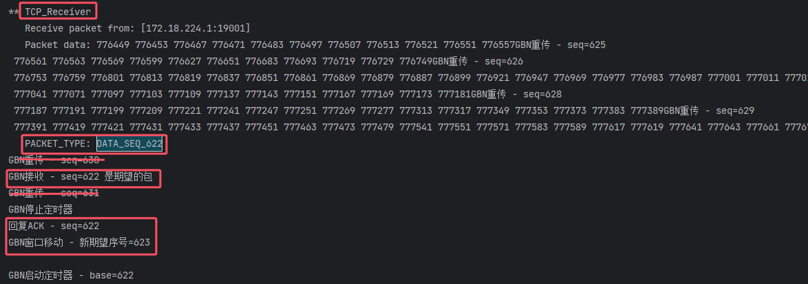
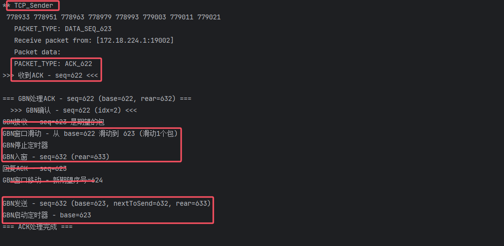

日志分析:

GBN:

接收方丢弃乱序的包:

LOG图片:


## 复制以下内容到 Typora

```
# GBN 协议日志分析与特性验证

本次实验基于 eflag=7环境，日志完整捕获了 GBN 协议在超时后的批量重传行为以及正常的累积确认流程。

## 一、 核心特性验证：超时与批量重传

**GBN 的核心特征**：一旦定时器超时，发送方必须重传窗口内所有已发送但未确认的分组（"Go-Back-N"）。

### 日志证据截取
```text
!!! GBN超时 - 重传窗口内所有包 [622,632) !!!
GBN重传 - seq=622
GBN重传 - seq=623
GBN重传 - seq=624
GBN重传 - seq=625
GBN重传 - seq=626
GBN重传 - seq=627
GBN重传 - seq=628
GBN重传 - seq=629
GBN重传 - seq=630
GBN重传 - seq=631
```

### 分析

1. 
2. **触发条件**：日志显示 !!! GBN超时 ... !!!，说明基序号（Base）为 **622** 的包定时器超时。
3. **重传范围**：窗口当前范围是 [622, 632)，即包含序号 622 到 631 的共 **10个包**。
4. **批量行为**：发送方没有像 SR 那样只重传 622，而是一口气连续重传了 622, 623, ..., 631。这完美验证了 GBN **"宁可错杀一千（重传所有），不可放过一个"** 的策略。

------


## 二、 核心特性验证：按序接收与累积确认

**GBN 的核心特征**：接收方只接收期望序号 (expectedSeq) 的包，发送方通过移动 Base 来实现累积确认。

### 日志证据截取

```
-> 2025-12-27 15:29:39:133 CST
** TCP_Receiver
   PACKET_TYPE: DATA_SEQ_622
GBN接收 - seq=622 是期望的包
回复ACK - seq=622
GBN窗口移动 - 新期望序号=623

-> 2025-12-27 15:29:39:134 CST
** TCP_Sender
   PACKET_TYPE: ACK_622
>>> 收到ACK - seq=622 <<<
=== GBN处理ACK - seq=622 (base=622, rear=632) ===
  >>> GBN确认 - seq=622 (idx=2) <<<
GBN窗口滑动 - 从 base=622 滑动到 623 (滑动1个包)
GBN停止定时器
GBN入窗 - seq=632 (rear=633)
GBN发送 - seq=632
GBN启动定时器 - base=623
```

### 分析

1. 
2. **接收方逻辑**：
   - 
   - 接收到 DATA_SEQ_622，日志确认 seq=622 是期望的包。
   - 接收方立即更新状态：新期望序号=623，并回复 ACK_622。
3. **发送方逻辑**：
   - 
   - 收到 ACK_622 后，窗口基序号 base 从 622 变为 623。
   - **关键动作**：GBN停止定时器 -> GBN启动定时器 - base=623。这表明 GBN **只有一个全局定时器**，每当 Base 移动时，定时器会重启以服务新的 Base（623）。
   - **滑动窗口**：窗口向前滑动后，空出了位置，允许新的包 seq=632 入窗并发送。

------


## 三、 连续交互流程图解

根据日志时间戳，我们可以重构出以下时间线：

| 时间   | 角色         | 动作                 | 状态变化                                                |
| ------ | ------------ | -------------------- | ------------------------------------------------------- |
| **t0** | **Sender**   | **超时！** Base=622  | 触发重传逻辑                                            |
| t0+    | Sender       | **批量重传** 622-631 | 占用信道发送10个包                                      |
| **t1** | **Receiver** | 收到重传的 **622**   | expectedSeq 622 -> 623                                  |
| t1+    | Receiver     | 回复 **ACK 622**     |                                                         |
| **t2** | **Sender**   | 收到 **ACK 622**     | Base 622 -> 623<br>重启定时器 (服务623)<br>发送新包 632 |
| **t3** | **Receiver** | 收到重传的 **623**   | expectedSeq 623 -> 624                                  |
| t3+    | Receiver     | 回复 **ACK 623**     |                                                         |
| **t4** | **Sender**   | 收到 **ACK 623**     | Base 623 -> 624<br>重启定时器 (服务624)                 |

## 四、 总结

上述日志数据有力地证明了该 GBN 协议实现的正确性：

1. **重传机制**符合 Go-Back-N 定义（超时后重发窗口内所有分组）。
2. **定时器管理**符合标准（单一定时器，随 Base 移动而重启）。
3. **接收逻辑**符合标准（按序接收，严格匹配期望序号）。

下面一个图片描述 重传窗口的内所有包的截图:


接收方收到622包之后：



符合期望的包 然后更新新的期望序号并回复ack

接收方收到ack后:



停止622的计时器 滑动窗口 启动623的计时器

不符合期望序号的包接收方不会接收：

