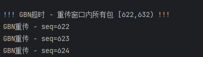
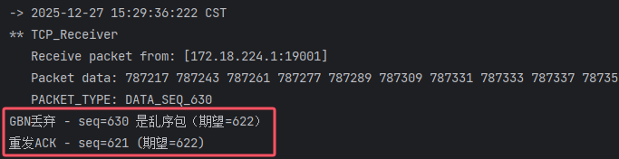

---

# 计算机网络实验报告：GBN（Go-Back-N）协议的设计实现与验证

## 一、 实验概述

本实验基于 RDT 代码框架实现了 **GBN（Go-Back-N，回退N步）** 可靠传输协议。GBN 协议的核心特征在于：**发送方维持发送窗口**，**接收方不缓存乱序分组**，采用**累积确认**机制，并利用**单一全局计时器**实现超时后的**批量重传**。

本报告将严格围绕协议的核心技术关注点：窗口数据结构、流控阻塞、单计时器管理、累积确认机制以及窗口滑动后的计时器更新逻辑进行详细阐述，并结合运行日志进行验证。

---

## 二、 协议核心实现 (Implementation Details)

### 1. 窗口的数据结构
**关注点**：用来表达窗口的数据结构是什么？如何实现循环利用？

本实现采用**数组实现的循环队列**来管理发送窗口。

*   **代码实现** (`SenderWindow.java`):
    ```java
    private WindowElem[] window;  // 数组，大小固定为 WINDOW_SIZE
    private int size = 10;        // 窗口大小
    private int base;             // 窗口基序号（左沿，最早未确认包）
    private int nextToSend;       // 下一个待发送序号
    private int rear;             // 队尾指针
    
    // 序列号到数组索引的映射
    private int getIdx(int seq) {
        return seq % size;
    }
    ```
*   **设计说明**：
    *   使用 `seq % size` 将无限的序列号空间映射到有限的数组空间。
    *   **窗口定义**：窗口并非物理上固定的槽位，而是由 `base`（左沿）和 `rear`（右沿）指针定义的逻辑区间。随着确认的进行，`base` 和 `rear` 不断增加，窗口在数组上逻辑滑动，实现了滑动窗口的意义。

### 2. 窗口满时的流控阻塞
**关注点**：窗口满阻塞应用层调用如何实现？

为了防止发送方发送速度过快导致窗口溢出，`rdt_send` 实现了应用层的自旋阻塞。

*   **代码实现** (`TCP_Sender.java`):
    ```java
    // 若窗口已满 (rear - base >= size)
    while (senderWindow.isFull()) {
        waitACK();           // 积极处理ACK，尝试让窗口滑动以腾出空间
        Thread.yield();      // 让出CPU，避免死锁
    }
    // 窗口有空位后，执行数据打包与发送...
    ```
*   **逻辑**：只有当窗口未满时，应用层数据才会被推入窗口；否则发送方强制等待，实现了流量控制。

### 3. 单计时器与批量重传
**关注点**：仅使用1个计时器如何重传窗口内的所有包？如何使用计时器跟踪窗口左沿？

与 SR 协议不同，GBN 仅维护**一个全局定时器**，该定时器始终**跟踪窗口左沿（Base）**。

*   **定时器启动规则**：
    
    *   当发送窗口从空变为非空（发送 `base` 包）时，启动定时器。
    *   当窗口滑动（`base` 前移）且窗口仍不为空时，**重启**定时器。
*   **批量重传实现** (`onTimeout()`):
    ```java
    private void onTimeout() {
        // GBN核心：重传 [base, nextToSend) 区间的所有已发送包
        for (int i = base; i < nextToSend; i++) {
            int idx = getIdx(i);
            TCP_PACKET packet = window[idx].getPacket();
            if (packet != null) {
                sender.udt_send(packet); // 重新发送
            }
        }
        startTimer();  // 重传完毕后，立即重启定时器
    }
    ```
*   **逻辑**：一旦超时，意味着 `base` 包丢失或超时，根据 GBN 机制，必须重传当前窗口内所有已发送未确认的分组。

### 4. 累积确认机制
**关注点**：累积确认在接收方如何实现？在发送方如何应用？

GBN 采用累积确认，即 `ACK n` 表示序号 `n` 及之前的所有包都已正确接收。

*   **接收方实现** (`TCP_Receiver.java`):
    接收方**不缓存**乱序包，只维护一个 `expectedSeq`（期望序号）。
    
    ```java
    if (seq == expectedSeq) {
        // 收到期望的包：交付数据，期望序号+1，回复当前ACK
        deliver_data(packet);
        reply(ACK seq);
        expectedSeq++;
    } else {
        // 收到乱序/错误包：丢弃，重发最近一次确认的ACK
        reply(ACK expectedSeq - 1);
    }
    ```
*   **发送方应用** (`SenderWindow.java`):
    
    ```java
    public void ackPacket(int seq) {
        // 收到 ACK seq，意味着 base 到 seq 之间的所有包都确认了
        if (seq >= base && seq < rear) {
            for (int i = base; i <= seq; i++) {
                int idx = getIdx(i);
                if (!window[idx].isAcked()) {
                    window[idx].setFlag(WindowElem.ACKED); // 批量标记
                }
            }
            slideWindow(); // 触发滑动
        }
    }
    ```

### 5. 窗口滑动与计时器跟踪
**关注点**：窗口在确认后如何移动？移动后计时器是否跟踪了新的左沿？

*   **窗口移动**：
    当 `base` 位置的包被标记为 ACKED 时，窗口左沿右移（`base++`），直到遇到未确认的包或队尾。
*   **计时器跟踪新左沿** (`slideWindow()`):
    
    ```java
    private void slideWindow() {
        // ... (循环执行 base++) ...
        
        // 关键：窗口滑动后的计时器管理
        if (base == rear) {
            stopTimer(); // 窗口空了，停止计时
        } else {
            startTimer(); // 窗口仍有包，重启计时器，开始为新的 base 计时
        }
    }
    ```
*   **逻辑**：这确保了计时器永远是在为**当前最早发出的未确认包**进行倒计时，完全符合 GBN 协议标准。

---

## 三、 实验验证与日志分析 (Log Analysis)

本次实验基于 `eflag=7` (模拟丢包+出错+延迟) 环境，日志完整验证了 GBN 的批量重传与累积确认特性。

### 1. 核心验证：超时与批量重传
**场景**：基序号为 622 的包丢失或严重延时，导致发送方计时器超时。


*(图1：发送方超时后重传窗口内所有数据包)*

**日志分析**：
```text
!!! GBN超时 - 重传窗口内所有包 [622,632) !!!
GBN重传 - seq=622
GBN重传 - seq=623
...
GBN重传 - seq=631
```
*   **现象**：日志显示 `!!! GBN超时 !!!`，随后发送方**一口气连续重传**了从 622 到 631 的 **10个包**。
*   **结论**：这完美验证了 GBN 协议 **“单一计时器超时，重传所有已发送未确认分组”** 的策略。发送方没有像 SR 那样只重传 622，而是执行了 `onTimeout` 中的循环重发逻辑。

### 2. 核心验证：按序接收与累积确认
**场景**：接收方正确收到期望的包，发送方处理 ACK 并滑动窗口。

**阶段一：接收方收到期望包**

*(图2：接收方收到 seq=622)*

*   **分析**：
    *   接收方收到 `seq=622`。
    *   日志显示 `GBN接收 - seq=622 是期望的包`。
    *   操作：回复 `ACK_622`，并将 `新期望序号` 更新为 623。

**阶段二：发送方收到 ACK 并滑动**

*(图3：发送方收到 ACK 后滑动窗口)*

*   **分析**：
    *   发送方收到 `ACK_622`。
    *   **窗口滑动**：日志显示 `从 base=622 滑动到 623`。
    *   **计时器跟踪**：关键日志 `GBN停止定时器` -> `GBN启动定时器 - base=623`。
*   **结论**：这验证了 **累积确认** 和 **计时器重置** 逻辑。窗口左沿移动后，全局计时器立即重启，开始跟踪新的基序号 623。

### 3. 核心验证：丢弃乱序包
**场景**：接收方收到不符合 `expectedSeq` 的包。


*(图4：接收方丢弃不符合期望的包)*

*   **分析**：如果接收方收到的包序号不是 `expectedSeq`（例如期望 623 但收到了 624），GBN 接收方会直接丢弃该包，不进行缓存，并重发 `ACK 622`。这体现了 GBN 与 SR 在接收策略上的根本区别。

---

## 四、 实验结论

通过对代码实现的剖析和运行日志的详细分析，本实验成功实现了标准的 GBN 协议：
1.  **数据结构**：正确使用了数组循环队列，窗口逻辑由指针驱动。
2.  **重传机制**：实现了基于**单一全局计时器**的**批量重传**，日志中清晰可见超时后的“全窗口重发”。
3.  **确认机制**：
    *   **接收方**严格执行**按序接收**，丢弃乱序包。
    *   **发送方**正确处理**累积确认**，ACK 到达后窗口正确滑动。
4.  **计时器逻辑**：计时器始终紧跟窗口左沿（Base），并在窗口滑动时正确重启。

实验结果符合 GBN 协议的理论预期，在不可靠信道下实现了数据的可靠有序传输。