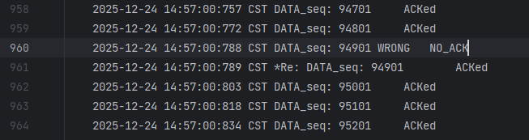
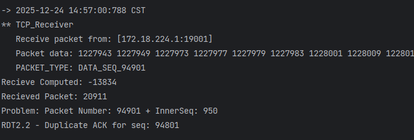
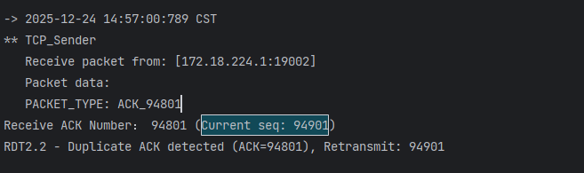
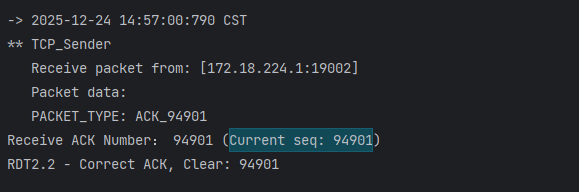

# RDT 2.2 协议分析与验证

## 一、理论基础：RDT 2.2 核心改进

RDT 2.2协议相比RDT 2.0最大的改进是**不再使用NACK信号**，而是通过**重复ACK**来指示错误。这种设计的思想是：只用一种反馈信号（ACK）就能完成错误检测和恢复。

这种设计的巧妙之处在于：
1. **简化协议**：只用一种信号类型（ACK）完成错误控制
2. **隐式反馈**：通过ACK号的重复性来隐式传达错误信息
3. **状态同步**：发送方通过ACK序列号的变化感知接收方的状态

这种机制体现了网络协议设计中的一个重要原则：**用最简单的机制实现最可靠的功能**。通过重复ACK这个简单概念，RDT 2.2在不增加信号类型的情况下，实现了与NACK相同的功能。

## 二、实现机制：接收方与发送方

### 2.1 接收方实现原理 (TCP_Receiver.java)

接收方在`TCP_Receiver.java`中增加了关键变量：
```java
int lastCorrectSeq = 0; //记录上一个正确接收的包序号
```

**正常情况处理**：
```java
if(CheckSum.computeChkSum(recvPack) == recvPack.getTcpH().getTh_sum()) {
    // 数据包正确，生成ACK报文段（设置确认号）
    tcpH.setTh_ack(recvPack.getTcpH().getTh_seq());
    ackPack = new TCP_PACKET(tcpH, tcpS, recvPack.getSourceAddr());
    tcpH.setTh_sum(CheckSum.computeChkSum(ackPack));
    // 设置错误控制标志为0（数据无错误）
    tcpH.setTh_eflag((byte)0);
    // 回复ACK报文段
    reply(ackPack);

    // 更新上一个正确接收的包序号
    lastCorrectSeq = recvPack.getTcpH().getTh_seq();

    // 将接收到的正确有序的数据插入data队列，准备交付
    dataQueue.add(recvPack.getTcpS().getData());
    sequence++;

    System.out.println("RDT2.2 - ACK for seq: " + recvPack.getTcpH().getTh_seq());
}
```

**错误情况处理**：
```java
else{
    // RDT 2.2：数据包损坏，发送上一个正确接收的包的ACK（重复ACK）
    System.out.println("Recieve Computed: "+CheckSum.computeChkSum(recvPack));
    System.out.println("Recieved Packet: "+recvPack.getTcpH().getTh_sum());
    System.out.println("Problem: Packet Number: "+recvPack.getTcpH().getTh_seq()+" + InnerSeq: "+sequence);

    // RDT 2.2核心：不使用NACK，而是重发上一个正确ACK
    tcpH.setTh_ack(lastCorrectSeq);  // 发送上一个正确的ACK（重复ACK）
    ackPack = new TCP_PACKET(tcpH, tcpS, recvPack.getSourceAddr());
    tcpH.setTh_sum(CheckSum.computeChkSum(ackPack));
    // ACK包也设置为0（这是正常的ACK，只是重复的）
    tcpH.setTh_eflag((byte)0);
    // 回复重复ACK
    reply(ackPack);

    System.out.println("RDT2.2 - Duplicate ACK for seq: " + lastCorrectSeq);
}
```

当接收方收到损坏的数据包时，它不会发送NACK，而是发送上一个正确接收的数据包的ACK号。这样发送方通过检测重复的ACK号就能知道当前包出了问题。

### 2.2 发送方实现原理 (TCP_Sender.java)

发送方在`TCP_Sender.java`中增加了关键变量：
```java
int lastAckReceived = 0; // 记录上一次收到的ACK号（用于检测重复ACK）
```

**重复ACK检测逻辑**：
```java
@Override
// 接收到ACK报文：RDT2.2 通过检测重复ACK来判断错误
public void recv(TCP_PACKET recvPack) {
    int receivedAck = recvPack.getTcpH().getTh_ack();
    int currentSeq = tcpPack.getTcpH().getTh_seq();

    System.out.println("Receive ACK Number： " + receivedAck + " (Current seq: " + currentSeq + ")");

    // RDT 2.2 核心逻辑：检测重复ACK
    if (receivedAck == currentSeq) {
        // 情况1：收到正确ACK，确认号与当前发送序号匹配
        System.out.println("RDT2.2 - Correct ACK, Clear: " + currentSeq);
        lastAckReceived = receivedAck;  // 更新上次ACK
        flag = 1;  // 设置标志，允许发送下一包
    } else if (receivedAck == lastAckReceived && receivedAck != 0) {
        // 情况2：RDT 2.2 重复ACK → 说明当前包出错，需要重传
        System.out.println("RDT2.2 - Duplicate ACK detected (ACK=" + receivedAck + "), Retransmit: " + currentSeq);
        udt_send(tcpPack);  // 重传当前包
    } else if (receivedAck < currentSeq) {
        // 情况3：收到旧的ACK（可能是第一次收到的重复ACK）
        System.out.println("RDT2.2 - Old ACK (ACK=" + receivedAck + " < seq=" + currentSeq + "), Retransmit: " + currentSeq);
        lastAckReceived = receivedAck;  // 记录这个ACK，下次如果重复就能检测到
        udt_send(tcpPack);  // 重传
    } else {
        // 情况4：其他错误情况
        System.out.println("RDT2.2 - Unexpected ACK, Retransmit: " + currentSeq);
        udt_send(tcpPack);
    }
    System.out.println();
}
```

发送方通过对比收到的ACK号与上次收到的ACK号来检测重复ACK：
1. **正确ACK**：收到的ACK号等于当前发送包序号 → 正常继续
2. **重复ACK**：收到的ACK号等于上一次收到的ACK号 → 检测到错误，重传当前包
3. **旧ACK**：收到的ACK号小于当前包序号 → 可能是第一次遇到的重复，记录并重传

## 三、实际验证：日志分析

通过实际运行程序的日志分析，我们可以验证RDT 2.2协议的实现效果。以下是一个典型的数据包重传案例：

### 3.1 重传事件发现
在Log中查到重传了seq为94901的数据包



### 3.2 错误检测过程
然后去终端中查找相关信息，找到了：



上图说明：接收方将接收到的数据包进行校验发现数据包出错了，接收端计算出来的校验和为-13834，然后数据包首部存的校验和为20911两者不相等，然后发送对于seq为94801的重复ack确认包。

### 3.3 重传触发机制


上图说明：发送方接收到了对于seq为94801的重复确认包，因为94801<当前seq:94901进行重传seq为94901的数据包。

### 3.4 重传成功确认


上图说明：接收方收到了正确的seq为94901的包，然后发送ack确认。然后就继续正常发送了。

这个实际案例完美验证了RDT 2.2协议的工作流程：
1. 接收方检测到数据包损坏（校验和不匹配）
2. 发送方发送上一个正确接收包的ACK（重复ACK：94801）
3. 发送方检测到重复ACK，触发重传机制（重传94901）
4. 重传成功，恢复正常传输

## 四、对比分析：RDT 2.0 vs RDT 2.2

| 特性               | RDT 2.0                     | RDT 2.2                                  |
| ------------------ | --------------------------- | ---------------------------------------- |
| **接收方出错处理** | 发送 NACK (ack=-1, eflag=1) | 发送重复ACK (ack=上一个正确seq, eflag=0) |
| **发送方错误检测** | 检查 eflag==1               | 检测重复的 ACK 号                        |
| **ACK 包类型**     | ACK 和 NACK 两种            | 只有 ACK                                 |
| **eflag 使用**     | ACK=0, NACK=1               | 全部 ACK=0                               |
| **优势**           | 明确区分正确/错误           | 更简单，只用一种反馈机制                 |

## 五、总结

RDT 2.2协议通过巧妙的设计，用重复ACK机制替代了NACK机制，实现了错误检测和恢复功能。理论实现与实际运行日志的对比验证了该协议的有效性。这种设计不仅简化了协议实现，还保持了可靠的错误恢复能力，体现了网络协议设计中"用最简单机制实现最可靠功能"的重要原则。