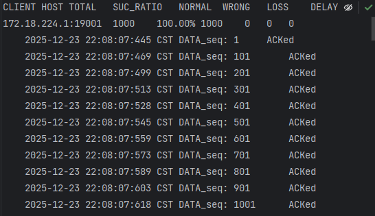
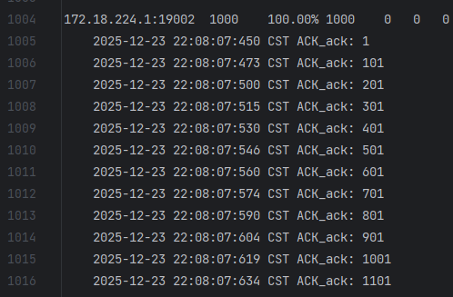
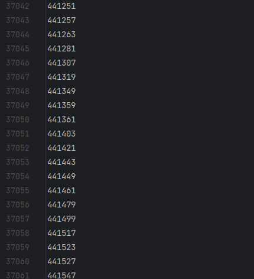

配置好IDEA开发环境后，请首先运行老师提供的 RDT 1.0 代码，并观察其运行结果。

这段 RDT 1.0 代码实现了一个简化的 TCP 发送方和接收方，它会在控制台实时输出两端的状态信息。需要注意的是，RDT 1.0 的设计建立在底层信道完全可靠的假设之上，因此它并未对数据包可能出现的位错误、丢失或重复等异常情况进行任何处理。

在TCP_Receiver和TCP_Sender文件中已经设置了相应的eflag为0 表明了发送端发送数据时标记无错误，接收端在回复ack时也会标记无错误。符合RDT1.0的对于底层信道完全可靠的假设:

TCP_Receiver的相应代码位置:

```java
//回复ACK报文段
public void reply(TCP_PACKET replyPack) {
    //设置错误控制标志
    tcpH.setTh_eflag((byte)0); //eFlag=0，信道无错误
          
    //发送数据报
    client.send(replyPack);
}
```

TCP_Sender相应代码位置:

```java
public void udt_send(TCP_PACKET stcpPack) {
    //设置错误控制标志
    tcpH.setTh_eflag((byte)0);    
    //System.out.println("to send: "+stcpPack.getTcpH().getTh_seq());           
    //发送数据报
    client.send(stcpPack);
}
```

查看Log以及revcData：

从Log.txt中可以看到：

Sender Log（发送端日志）解读：



172.18.224.1:19001：发送端IP和端口
TOTAL: 1000：总共发送1000个数据包
SUC_RATIO: 100%：成功率100%
NORMAL: 1000：正常接收1000个
WRONG: 0：错误数据包0个
LOSS: 0：丢失数据包0个
DELAY: 0：延迟数据包0个
每一条数据行表示一个发送的数据包：

时间戳：数据发送时间
DATA_seq: 1：序列号为1
ACKed：已收到ACK确认

2. Receiver Log（接收端日志）解读：



与Sender Log对应，显示接收端确认的情况。

3. recvData.txt 解读：

这个文件包含接收端接收到的实际数据。



也是完整的
