---

# SR协议实现总结与日志分析

## 一、 核心设计思想

SR（Selective Repeat，选择重传）协议的核心思想是：**只重传出错的那一个包，绝不冤枉后面正常的包。**

为了实现这一高效机制，系统必须具备两个关键的复杂功能：

1.  **接收方具备“缓存能力” (Receiver Buffering)**
    *   当期望序号的包（如2号）丢失，但后续包（如3号）到达时，接收方不能丢弃3号。
    *   必须使用缓冲区（代码中的 `ReceiverWindow` 数组）将3号先暂存，等待2号补齐后，再按顺序一起提交给上层。

2.  **发送方具备“独立定时器” (Independent Timers)**
    *   发送方不能只维护一个定时器。
    *   窗口内的每个数据包（代码中的 `SenderElem`）都必须拥有独立的逻辑秒表（`Timer`）。若1号包丢失，仅1号超时重传；若2号丢失，仅2号超时重传，互不干扰。

---

## 二、 关键场景日志分析

本次测试重点分析了 **Seq=300** 数据包在发生延迟（Delay）或丢失（Loss）时的系统行为。

### 1. 场景触发：模拟延迟/丢包
**现象描述**：Seq=300 的数据包在发送过程中出现严重延迟（模拟丢包），发送方继续发送后续的 Seq=301, 302 等数据包。

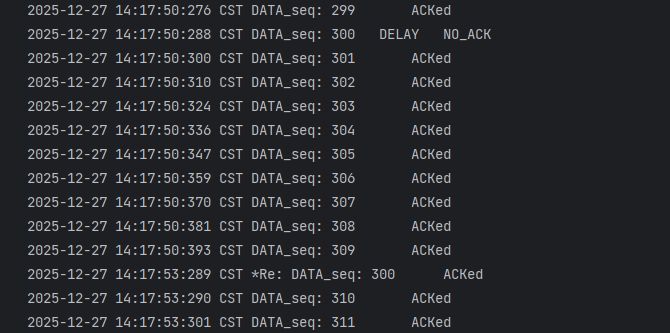
*图1：发送方连续发送，Seq 300 未被确认*

---

### 2. 证据一：乱序缓存与独立确认
**目的**：证明接收方没有丢弃乱序包（区别于 GBN），且发送方正确记录了非连续的 ACK。

**日志定位**：`DATA_SEQ_309` 与 `ACK_309` 的处理部分。

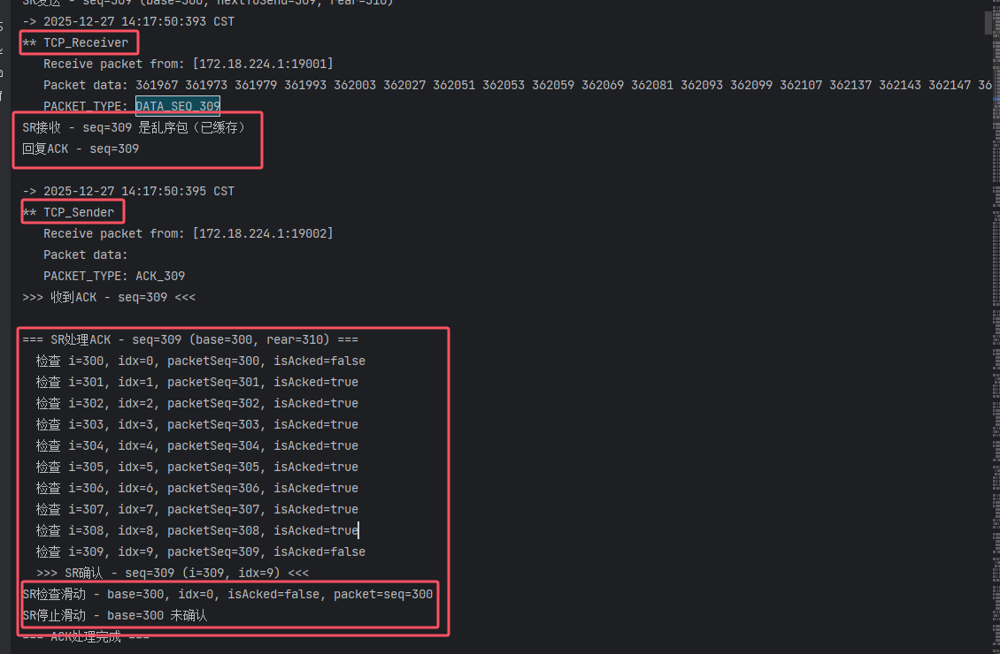
*图2：接收方缓存乱序包 & 发送方记录非连续ACK*

**关键点分析**：
*   **接收方**：日志显示 `SR接收 - seq=309 是乱序包（已缓存）`。
    *   **结论**：证明接收窗口具备缓存能力，未丢弃后续到达的包。
*   **发送方**：在处理 ACK 309 时，状态检查显示：
    *   `i=300... isAcked=false` （基序号未确认）
    *   `i=301... isAcked=true` （后续包已确认）
    *   ...
    *   `i=309... isAcked=false`
*   **窗口状态**：日志显示 `SR停止滑动 - base=300 未确认`。
    *   **结论**：证明发送窗口正确地被未确认的基序号（base）阻塞，未发生错误滑动。

---

### 3. 证据二：超时重传与补全
**目的**：证明丢失的包（Seq 300）被独立定时器触发重传并成功接收。

**日志定位**：时间戳 `14:17:53` 附近。

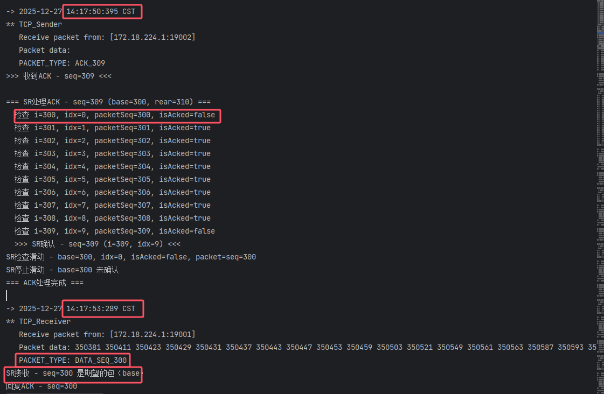
*图3：Seq 300 超时重传并被接收*

**关键点分析**：
*   **接收方**：日志显示 `DATA_SEQ_300 ... SR接收 - seq=300 是期望的包（base）`。
*   **时间戳对比**：
    *   上一条正常交互日志时间：`14:17:50`
    *   重传收到日志时间：`14:17:53`
    *   **结论**：时间差约为 **3秒**，与设定的超时时间（3000ms）吻合，证明触发了 **超时重传** 机制。

---

### 4. 证据三：批量交付与累积滑动 (Core Feature)
**目的**：证明 SR 协议的高效性——一旦缺口补齐，后续已缓存数据瞬间处理。

**日志定位**：紧接着重传成功后的处理。

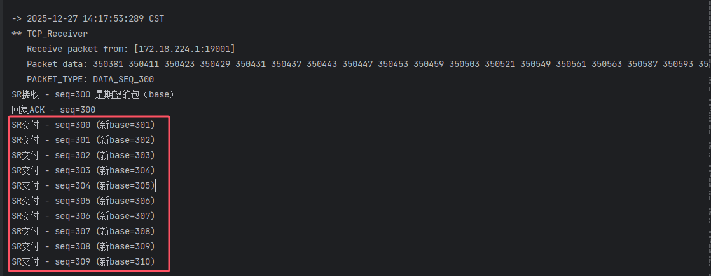
*图4：接收方批量交付数据*

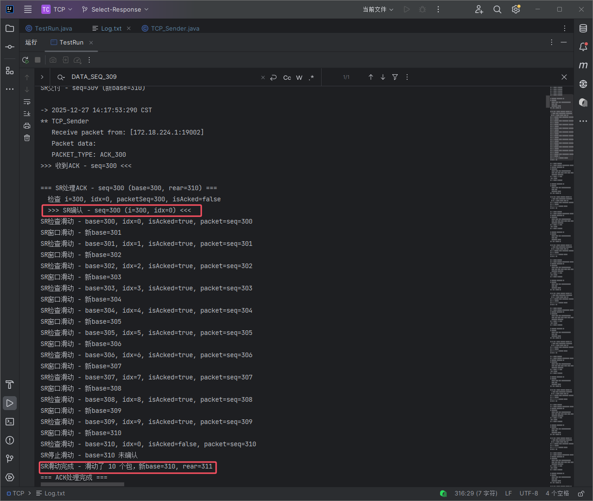
*图5：发送方窗口累积滑动*

**关键点分析**：
*   **接收方批量交付**：日志显示连续的 `SR交付` 操作：
    ```text
    SR交付 - seq=300
    SR交付 - seq=301
    ...
    SR交付 - seq=309
    ```
    这证明接收方缓冲逻辑正确，填补基序号后，自动将后续连续缓存的数据一并上交。
*   **发送方累积滑动**：收到 `ACK_300` 后，日志显示：
    ```text
    >>> SR滑动完成 - 滑动了 10 个包
    ```
    窗口 Base 从 300 直接跳变至 310，效率极高。

---

## 三、 机制验证总结

根据上述日志截图，SR协议在抗丢包/延时场景下的完整逻辑如下：

1.  **接收方行为**：
    当 Seq 300 丢失时，后续到达的 **301-309** 数据包并未被丢弃，而是被标记为 `乱序包（已缓存）` 并存入接收窗口，同时向发送方回复了对应的 ACK。这体现了 SR 协议与 GBN 的本质区别。

2.  **发送方行为**：
    收到 301-309 的 ACK 后，发送窗口记录了这些状态（`isAcked=true`），但由于基序号 **300** 未被确认，窗口保持阻塞状态（`停止滑动`），等待超时。

3.  **恢复与滑动**：
    约 3 秒后，超时重传机制触发。接收方收到补发的 **300** 号包后，检测到缓冲区中 301-309 已存在，随即触发 **批量交付** 机制，一次性向上层交付了 10 个数据包。发送方收到 300 的 ACK 后，也一次性将窗口 **滑动了 10 个位置**（base 从 300 变更为 310），通信完全恢复。

**结论**：该日志完美验证了 SR 协议的 **独立确认、乱序缓存、选择重传** 三大核心机制。

---

## 四、 其他异常场景测试

### 1. 丢包场景 (Packet Loss)
丢包场景的表现与严重延时一致，最终都依赖超时重传解决。

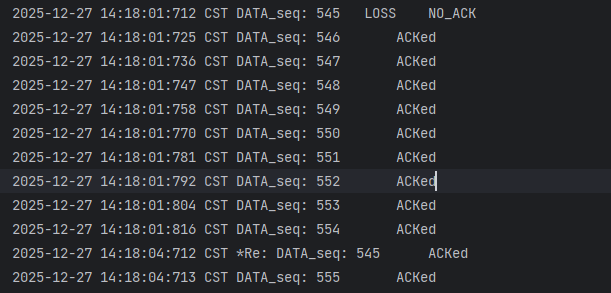
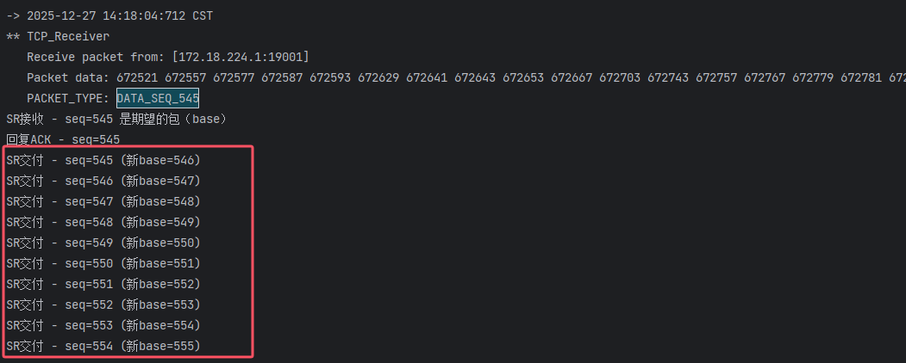
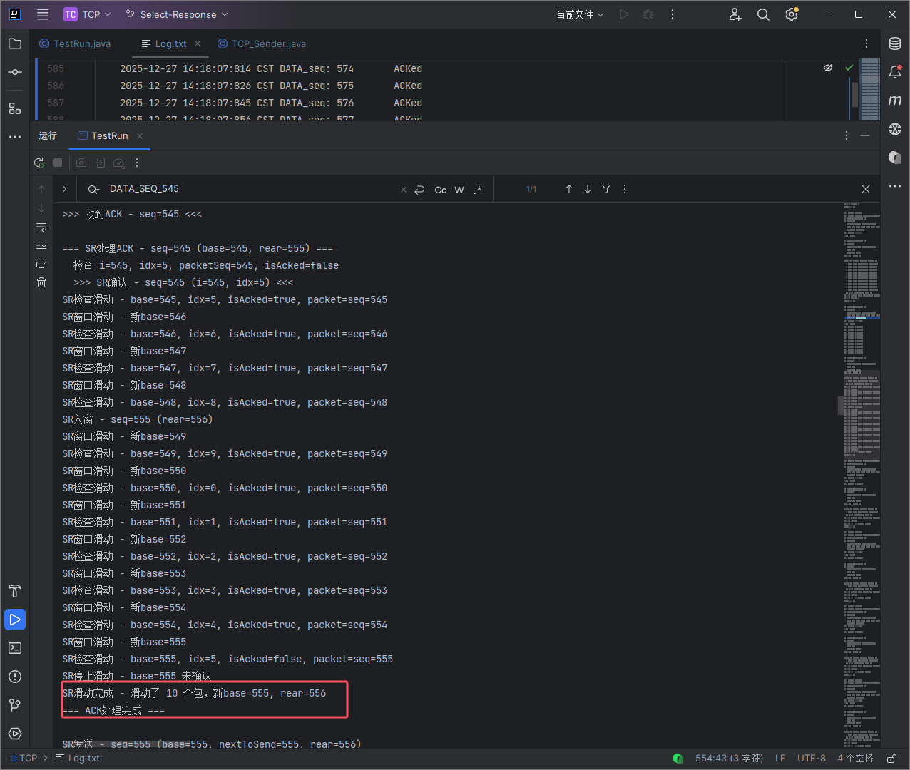

### 2. 位错场景 (Bit Error)
**机制**：校验和（Checksum）失败导致包被接收方丢弃，不回复ACK，发送方最终超时重传。在此期间，后续正确的包依然会被接收方缓存。

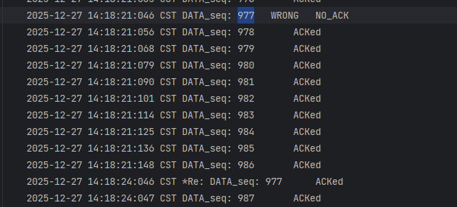
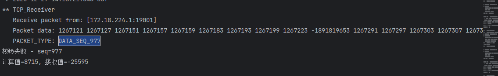
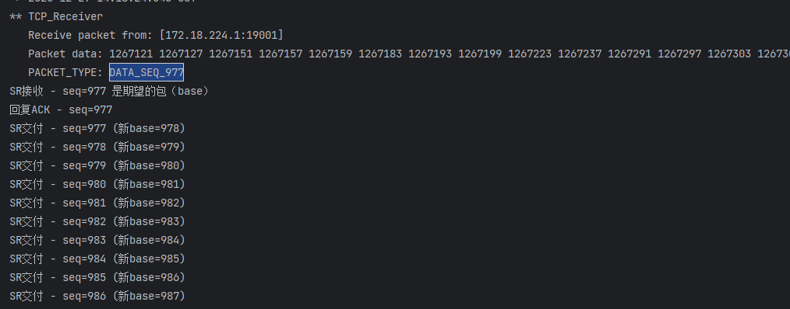

**结论**：无论是丢包、延时还是位错，SR协议均能通过 **"缓存乱序 + 超时重传特定包 + 批量交付"** 的策略保证数据的可靠有序传输。