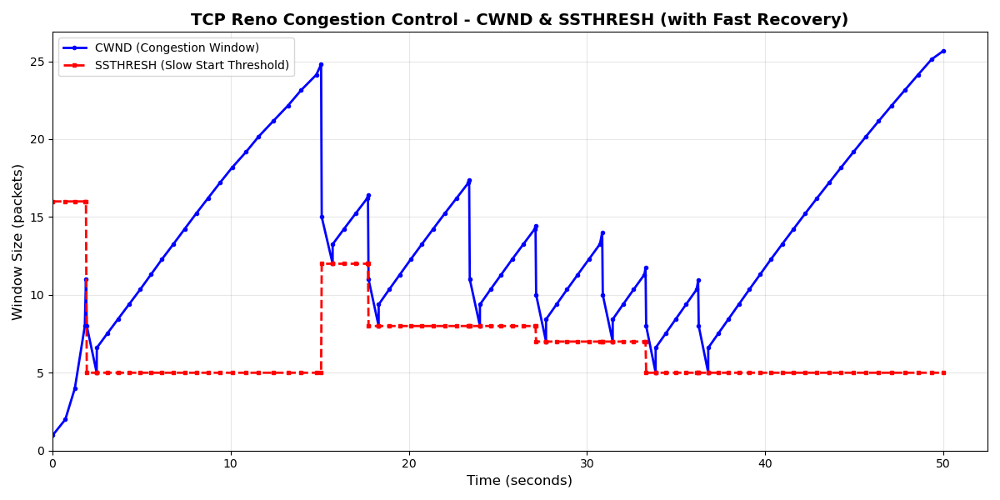

针对 **TCP Reno**，你需要通过截图证明它与 Tahoe 最本质的区别：**在发生快重传后，窗口没有降为 1，而是进入了“快恢复”状态，并且在收到后续冗余 ACK 时窗口会临时膨胀。**

你需要截取以下 **3 张核心图片**（外加一张可选的图表）来完美回答老师的检查点：

---

### 截图 1：证明“快重传触发与快恢复入口” (The Entry)

**目的**：证明收到 3 个重复 ACK 后，`cwnd` 被设置为 `ssthresh + 3`，而不是 1。

*   **操作**：运行程序，等待一次丢包（或制造丢包）。
*   **截图内容（Console/Sender Log）**：
    1.  连续收到 3 行 `收到重复ACK` 的日志。
    2.  紧接着出现一行 **“!!! TCP Reno 快重传触发 !!!”**。
    3.  **关键点**：下一行日志显示 **`cwnd` 变成了 `ssthresh + 3`**（例如：原窗口 16 -> ssthresh=8 -> cwnd=11）。
    4.  同时显示立即重传了丢失的包。
*   **对比说明**：Tahoe 在这里 `cwnd` 会变 1，而 Reno 维持在高位，证明进入了快恢复。

### 截图 3：证明“退出快恢复与窗口收缩” (The Exit)

**目的**：证明收到新数据确认（New ACK）后，窗口回归到拥塞避免状态（`ssthresh`）。

*   **操作**：等待重传的包到达接收方，接收方回复一个确认了新数据的 ACK。
*   **截图内容（Console/Sender Log）**：
    1.  收到一个 **New ACK**（确认号 > 之前的 base）。
    2.  **关键点**：日志显示 **“退出快恢复”**，且 **`cwnd` 瞬间变小**（回落到 `ssthresh`）。
        *   例如：之前膨胀到了 15.0，收到新 ACK 后，`cwnd` 变为 8.0（即 `ssthresh` 的值）。
    3.  随后 `cwnd` 开始线性增长（8.0 -> 8.125...）。
*   **分析话术**：“收到新 ACK 表明重传成功，Reno 协议立即退出快恢复模式。`cwnd` 被重置为 `ssthresh`（此时为 8），系统进入拥塞避免阶段，避免了像 Tahoe 那样从 1 开始慢启动的性能损失。”

---

### 可选截图 4：Cwnd 变化折线图 (The Sawtooth)

如果能用 Excel 或 Python 画出这张图，是最直观的“降维打击”。

*   **Reno 的波形**：应该是**“锯齿状” (Sawtooth)**。
    *   上升 -> 骤降到一半 -> 线性上升 -> 骤降到一半。
*   **Tahoe 的波形**：
    *   上升 -> 骤降到底(1) -> 指数上升 -> 线性上升。

**总结**：只要你截到了 **“3个重复ACK后 cwnd=ssthresh+3”** 和 **“后续重复ACK导致 cwnd 继续增加”** 这两个瞬间，你就拿到了 Reno 实现满分的证据。一定要用**终端输出（Console Output）**截图，因为文件Log里没有变量值。