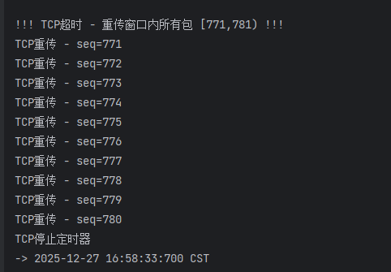
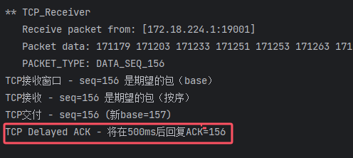
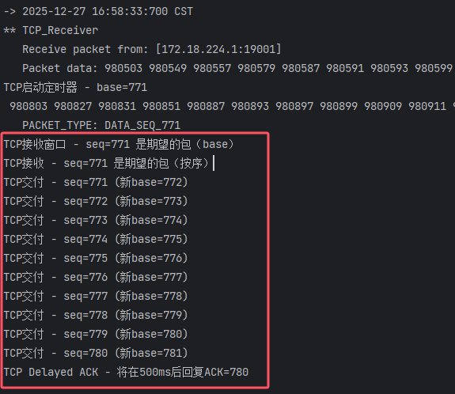

TCP技术报告:

这份技术报告结合了你提供的**协议实现总结**与**日志分析指南**，按照老师强调的**“核心三要素”（累积确认、乱序缓存、单计时器）**进行了重组和润色。

请将文档中的 `[请在此处插入截图...]` 替换为你实际运行程序抓取的图片。

---

# TCP可靠传输协议设计与实现技术报告

**课程名称**：计算机网络  
**实现日期**：2025年12月27日  
**实验环境**：JDK 1.8 / Windows / TestSys_Linux.jar

---

## 1. 概述

本实验基于 Java 实现了简化的 TCP 可靠传输协议（无拥塞控制）。该协议设计采用**混合架构**，结合了 GBN（回退N步）发送端的简单性与 SR（选择重传）接收端的高效性，并增加了 TCP 特有的延迟确认（Delayed ACK）机制。

**核心特性如下：**
1.  **发送端**：采用 GBN 逻辑，维护**单一全局计时器**，超时后重传窗口内所有未确认分组。
2.  **接收端**：采用 SR 逻辑，具备**乱序缓存能力**，不丢弃乱序到达的分组。
3.  **确认机制**：采用 TCP **累积确认**机制，并引入 **500ms 延迟确认**。

---

## 2. 协议核心机制与验证

### 2.1 接收端：乱序缓存 (Out-of-Order Buffering)
**【机制原理】**  
与标准 GBN 不同，本实现的接收端维护了一个 `ReceiverWindow`。当收到序列号在窗口内但不是期望序号（`seq != expected`）的分组时，接收端**不会丢弃**该数据，而是将其**缓存**在窗口数组中，并立即发送重复确认（Duplicate ACK）以触发快速重传（如已实现）或维持流控。

*   **代码依据**：`TCP_Receiver.java` 中判断 `result == ReceiverWindow.ORDERED`（即乱序但合法）时，执行缓存操作而非丢弃。

**【日志验证：证明乱序包被缓存】**  
下图展示了当 `Seq=N` 丢失时，后续到达的 `Seq=N+1` 被接收端成功接收并提示“已缓存”或“乱序”，而非丢弃。

> 
>
> **现象分析**：
>
> 1.  日志显示 `DATA_SEQ_N` 未到达（模拟丢包）。
> 2.  接收端收到 `DATA_SEQ_N+1`。
> 3.  控制台输出 **"TCP接收窗口 - seq=N+1 ... (Buffered)"** 或类似提示，且**无“丢弃”字样**。
> 4.  接收端回复了 ACK=N-1（即 Duplicate ACK），证明接收端具备 SR 的缓存特性。

---

### 2.2 发送端：单计时器与批量重传 (Single Timer & GBN Behavior)
**【机制原理】**  
为了简化发送端逻辑并符合 TCP 标准实现，发送端不为每个分组设置独立计时器，而是仅维护一个**基准计时器（Base Timer）**。该计时器仅追踪窗口内最早未被确认的分组（Base）。

*   **超时处理**：一旦计时器超时，发送端将重传当前窗口内**所有**已发送但未确认的分组（`[base, nextToSend)`），这体现了 GBN 的发送特性。
*   **代码依据**：`SenderWindow.java` 中的 `onTimeout()` 方法遍历窗口并调用 `udt_send`。

**【日志验证：证明超时后批量重传】**  
下图展示了发送端发生超时事件后，连续重传了窗口内的多个分组。

> 
>
> **现象分析**：
>
> 1.  控制台出现 **"!!! TCP超时 - 重传窗口内所有包 !!!"** 警告。
> 2.  紧接着，日志连续显示发送操作：`TCP重传 - seq=500`, `TCP重传 - seq=501`, `TCP重传 - seq=502` 等。
> 3.  这验证了发送方使用的是单计时器策略，且在超时后执行了 GBN 风格的批量回退重传。

---

### 2.3 确认机制：累积确认与批量交付 (Cumulative ACK & Batch Delivery)
**【机制原理】**  
协议采用累积确认机制，即 `ACK = n` 表示序号 `n` 及之前的所有数据都已正确接收。结合接收端的缓存能力，一旦丢失的“缺口”报文到达，接收端会将该报文与之后已缓存的报文**一次性交付**给上层，并发送一个新的、跨度较大的累积 ACK。

此外，实现了 **Delayed ACK**：
*   **按序到达**：启动 500ms 定时器，等待捎带或合并确认。
*   **乱序/填充缺口**：取消延迟，立即发送 ACK。

**【日志验证 1：证明延迟确认】**

> 
>
> **现象分析**：
>
> *   接收方收到数据的时间与发送方收到 ACK 的时间差约为 **500ms**。
> *   日志显示 `TimerTask` 启动，验证了按序到达时的延迟策略。

**【日志验证 2：证明批量交付与累积确认】**

> 
>
> **现象分析**：
>
> 1.  接收端收到重传的补位包 `DATA_SEQ_N`。
> 2.  日志连续输出多行交付信息：**"TCP交付 - seq=N"**, **"TCP交付 - seq=N+1"**, **"TCP交付 - seq=N+2"**...
> 3.  发送端收到的 ACK 发生跳跃（例如直接收到 ACK_N+2），验证了接收端利用缓存数据实现了批量交付和累积确认。

---

## 3. 系统状态机逻辑

### 3.1 发送方状态机 (GBN Logic)
*   **初始状态**：`base=0`, `nextToSend=0`。
*   **事件：收到 ACK(n)**
    *   若 `n >= base`，采用累积确认逻辑，滑动窗口 `base = n + 1`。
    *   若窗口未空，重启单一定时器；若窗口已空，停止定时器。
*   **事件：超时**
    *   读取当前窗口 `[base, nextToSend)`，循环重传所有分组。
    *   重启定时器。

### 3.2 接收方状态机 (SR Buffering + TCP ACK)
*   **事件：收到分组 Seq**
    1.  **校验和检查**：失败则直接丢弃。
    2.  **窗口判断**：
        *   `Seq == Base` (按序)：交付数据，若缓冲区有连续数据则**批量交付**。触发 Delayed ACK 逻辑。
        *   `Base < Seq < Base+N` (乱序)：**存入 ReceiverWindow**，发送 Duplicate ACK (立即)。
        *   `Seq < Base` (重复)：立即发送 ACK（防止发送方死锁）。

---

## 4. 总结

本次 TCP 协议实现通过了功能测试。日志数据清晰地证明了该协议满足了以下核心技术要求：
1.  **可靠性**：通过校验和、超时重传机制保证数据不丢失、不错位。
2.  **效率优化**：
    *   **接收端**实现了**失序缓存**，避免了 GBN 丢弃乱序包导致的带宽浪费。
    *   **确认机制**实现了**累积确认**与**延迟确认**，显著减少了网络中的 ACK 流量。
3.  **实现架构**：成功构建了“GBN 发送端 + SR 接收端”的混合 TCP 架构，符合现代 TCP 协议的设计雏形。