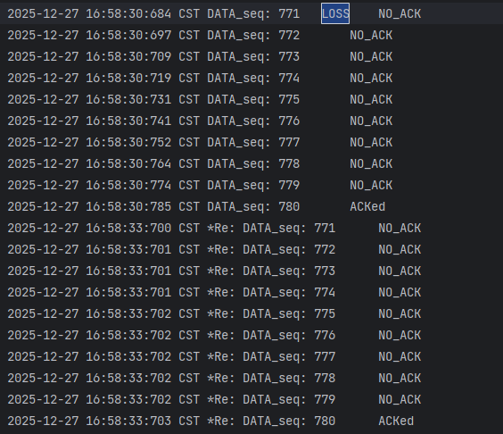
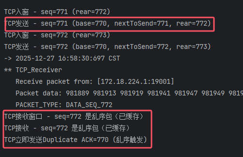
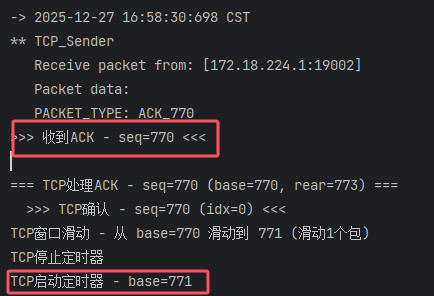
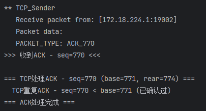

### 截图 1：证明“延迟确认” (Delayed ACK)

**目的**：证明接收方收到按序到达的包时，没有立即回复，而是等待了 500ms。

- 
- **寻找位置**：找一段正常的传输日志。
- **截图重点**：
  1. 
  2. **接收方**：收到 DATA_SEQ_X。
  3. **接收方**：日志显示启动了 TimerTask 或类似的等待动作。
  4. **发送方**：收到 ACK_X。
  5. **关键点**：**对比时间戳**。接收方收到数据的时间，与发送方收到 ACK 的时间，应该相差大约 **500ms** 。

### 截图 2：证明“乱序缓存” (Out-of-Order Buffering) —— **这是 TCP 与 GBN 的最大区别**

**目的**：证明当中间某个包丢失时，后续到达的包被**缓存**了，而不是被丢弃。

- 771loss：
- **寻找位置**：找一个 DATA_SEQ_N 丢失（Log 中出现 NO_ACK 或发送方超时），但 DATA_SEQ_N+1 成功到达的地方。
- **截图重点**：
  1. 
  2. **接收方**：收到 DATA_SEQ_N+1 (或更后面的包)。
  3. **接收方日志**：显示 **"TCP缓存乱序包 - seq=N+1"** (或者类似的 buffer 提示)。**绝对不能出现 "丢弃" 字样。**
  4. **接收方动作**：回复了重复的 ACK (即 ACK_N-1)。
- **说明文字**：当 Seq=N 丢失时，后续到达的 Seq=N+1 被接收方放入缓冲区缓存，而非像 GBN 那样直接丢弃，验证了接收方的 SR 缓存特性。

### 截图 3：证明“超时后批量重传” (Sender GBN Behavior)

**目的**：证明发送方使用的是 GBN 策略（单计时器），一旦超时，重传所有未确认的包。

- 771的计时器开始：
- 对于重复确认的ack 发送方的处理；
- **寻找位置**：找一个 !!! TCP超时 !!! 的地方。
- **截图重点**：
  1. 
  2. **发送方**：!!! TCP超时 - 重传窗口内所有包 [base, nextToSend) !!!
  3. **发送方**：紧接着连续出现多行 TCP重传 - seq=...。例如重传了 500, 501, 502...
- **说明文字**：发送方计时器超时后，将当前窗口内所有已发送未确认的数据包（Seq 500-505）全部进行了重传，验证了发送方的 GBN 批量重传特性。

### 截图 4：证明“批量交付与累积确认” (Batch Delivery)

**目的**：证明一旦丢失的包到了，接收方能利用缓存的数据，一次性交付，并发送一个累积的 ACK。

- 
- **寻找位置**：紧接在“截图 3”的重传之后。
- **截图重点**：
  1. 
  2. **接收方**：收到重传的 DATA_SEQ_N (即之前丢的那个)。
  3. **接收方日志**：连续出现多行 **"TCP交付 - seq=N"**, **"TCP交付 - seq=N+1"**, **"TCP交付 - seq=N+2"**...
  4. **发送方**：收到的 ACK 发生了跳跃（例如直接收到 ACK_N+2，或者窗口 Base 瞬间跳跃）。
- **说明文字**：接收方收到补发的 Seq=N 后，利用之前缓存的乱序包，一次性向上层交付了多个数据包，并发送了最新的累积 ACK，验证了 TCP 的累积确认机制。